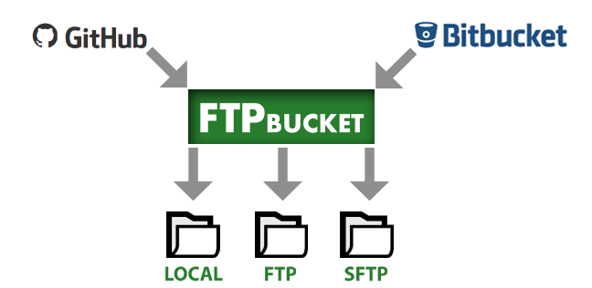

FTPbucket
=========

FTPbucket is a PHP script that enables you to sync your BitBucket or GitHub repository with any web-server.
It works with Git and Mercurial.

**How does it work?**
When you push to a GitHub or BitBucket repository, you can setup a hook that will be called after every push. This hook will send a payload containing what is changed to the server hosting the FTPbucket folder.
FTPbucket can apply the modifications on the same host or to another one through FTP or SSH (SFTP).

From one FTPbucket folder, you can manage an infinite number of hosts and repos.

**- release notes -**

**v0.8**

If you are updating, you should go for a fresh install. Erase everything except the config file.
- Removed support for deprecated BitBucket POST Hooks
- Moved BitBucket to API 2.0 Thanks to [d2roth](https://github.com/d2roth)

**v0.7**

If you are updating, you should go for a fresh install. Erase everything except the .txt files if you want to keep your logs.
- Support for GitHub
- Beta for SSH
- Renamed the folder 'deploy' to 'ftpbucket' to avoid confusion

**v0.6**

If you are updating, you should go for a fresh install. Erase everything except the .txt files if you want to keep your logs.
- Now compatible with both Webhooks and POST hooks from BitBucket. Many thanks to [Jacob Moen](https://github.com/jacmoe) for his help!
- Huge changes in order to support Github hooks in the future (soon!!!)

INSTALLATION
------------

If you want to use SSH, you must install the SSH2 extension available from PECL on the server hosting FTPbucket.

- Edit the config file sample and rename it to 'config.php'
- Copy the 'ftpbucket' folder on your server
- **On BitBucket** repository page, go to Settings>Webhooks>Add webhook and setup a hook pointing to http://myserver/ftpbucket/deploy.php with "Triggers > Repository push"
- **On GitHub** repository page, go to Settings>Webhooks & Services>Add webhook and setup a hook pointing to http://myserver/ftpbucket/deploy.php with 'Content Type > application/json' and "Just the push event".

Note: On BitBucket, POST hooks are still supported by FTPbucket (not working with version 0.7+).

LOGS
-----
You can see and clear the logs by connecting to http://myserver/ftpbucket/ 
You have to setup a password in the config file.

LIMITATIONS
-----------

The script only copies the files you are pushing. It means that if you start with this tool when you already have files in your repo, they won't be copied on the server. I'm looking for solutions on a full deploy.

MORE
----

I'm sure a lot of improvements can be made to my code so don't hesitate to fork and improve it! I would be glad to hear about your tests and issues too.

TODO
----

- Add a function to make a full sync

LICENCE
-------
Copyright (c) 2014-2016 [Thomas Malicet](http://www.thomasmalicet.com/)

This code is an open-sourced software licensed under the [BEER-WARE LICENCE] (https://fedoraproject.org/wiki/Licensing/Beerware)